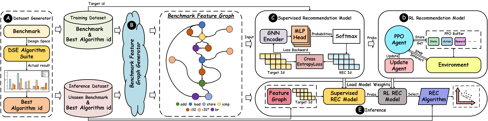

# SoberDSE_Supervised Pre-selection and Reinforcement Learning Optimization for Sample-Efficient HLS DSE Algorithm Selection

## Content
- [About the project](#jump1)
- [Project File Tree](#jump2)
- [Required environment](#jump3)

## <span id="jump1">About the project</span>

This project is an automated algorithm selection framework that autonomously extracts benchmark features and selects potentially optimal algorithms from a design space exploration algorithm suite. 



### Contribution
we propose SoberDSE, an automated framework featuring:
- We implemented most of existing DSE algorithms in the literature including seven heuristic techniques and three state-of-the-art (SOTA) RL methods, and found that no single DSE algorithm is universally optimal through extensive experiments.
- We redefine the research focus of DSE by integrating algorithm selection to provide recommendations for individual benchmarks, thereby mitigating the constraints imposed by the No-Free-Lunch theorem.
- To overcome the challenge of limited training data, we develop a hybrid approach that integrates supervised learning with reinforcement learning, enabling high-precision algorithm recommendation.
- Experimental results demonstrate that our proposed SoberDSE framework achieves highly accurate algorithm recommendations, delivering an average performance improvement of 81.06\% over heuristic-based DSE algorithms and 68.80\% over learning-based DSE methods.

## <span id="jump2">Project File Tree</span>
```
|--SoberDSE
  |--Best_result
  |--dse_database                    # database, graphs, codes to generate/analyze them
  |--ECoGNN                          # components of ECoGNN
  |   +--action_gumbel_layer.py
  |   +--layers.py
  |   +--model_parse.py
  |--SoberDSE                        # the implementation details of SoberDSE
  |--Data                            
  |--saved_models   
  |   +--data_gen.py
  |   +--Sober.py
  |--save_models_and_data       # save model weights and generate the files required for CDFGs
  |--src                             # the source codes for defining and training the model
  |   +--config.py
  |   +--config_ds.py
  |   +--main.py
  |   +--model.py
  |   +--nn_att.py
  |   +--parallel_run_tool_dse.py
  |   +--parameter.py
  |   +--programl_data.py
  |   +--result.py
  |   +--saver.py
  |   +--train.py
  |   +--utils.py
```

## <span id="jump3">Required environment</span>
- os Linux
- python 3.9.22
- torch 1.12.1+cu118
- torch_geometric 2.2.0
- openai 0.28.1
- numpy 1.23.5
- langchain 0.1.16
